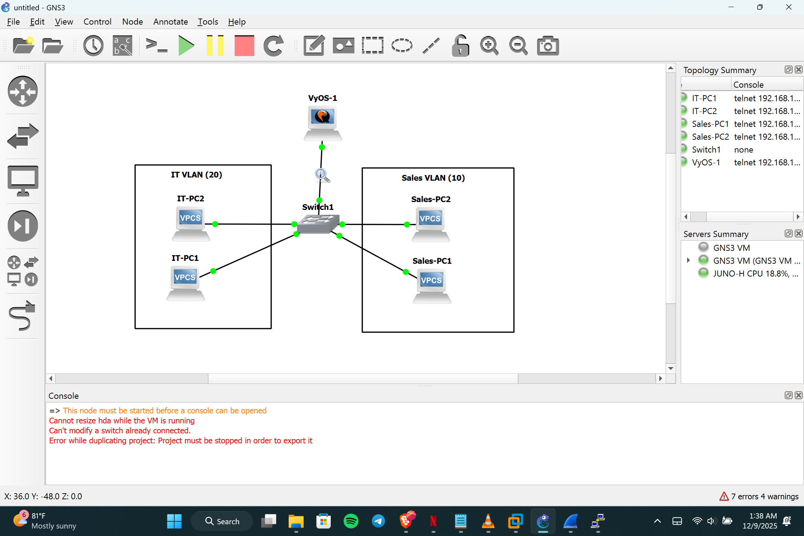
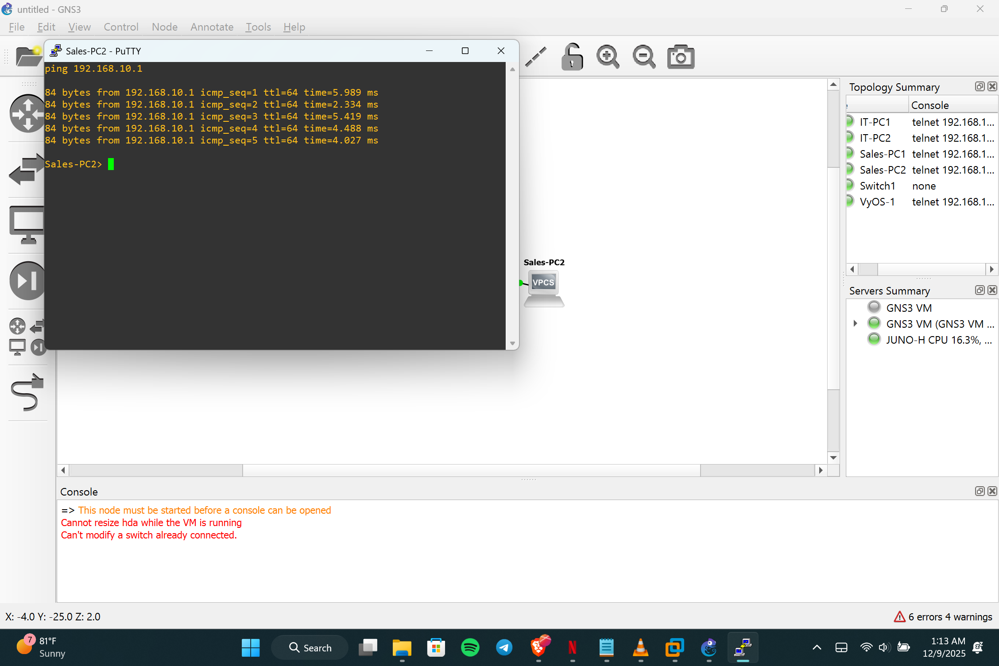

# Lab 2 – VLANs + Inter-VLAN Routing (Router-on-a-Stick)

**Date:** December 2025  
**Objective:** Implement VLAN segmentation with inter-VLAN routing using VyOS router-on-a-stick topology.

## Topology




## VyOS Configuration (Router-HQ)
```bash
configure

# VLAN 10 - Sales
set interfaces ethernet eth0 vif 10 address 192.168.10.1/24
set interfaces ethernet eth0 vif 10 description "Sales VLAN"

# VLAN 20 - IT
set interfaces ethernet eth0 vif 20 address 192.168.20.1/24
set interfaces ethernet eth0 vif 20 description "IT VLAN"

commit
save
